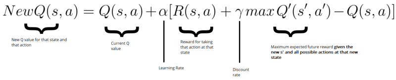

<h1 align="center" style="font-size=60px;">
   &#128013 QSnake
   <br>
   <br>
</h1>


**FPRO/MIEIC, 2019/20**

**Filipe Pinto Campos up201905609@fe.up.pt**

**1MIEIC07**

---------

## :triangular_flag_on_post: Objective


1. Create a clone of the famous snake game using Pygame
2. Implement Q-Learning

## :page_facing_up: Description

Replica of the classic Snake game.
The objective of this game is obtaining the most food possible without colliding either against a wall or against the player's tail.
This game can be played by a human or by an A.I agent based on Q-Learning.

## :game_die: UI


## :video_game: Controls
* **Movement** - Directional keys and WASD
* **Restart game** - Enter and Space
* **Change game speed in A.I mode** - Keys 1 through 4
* **Return to menu** - Esc


## :package: Packages

- Pygame
- Numpy

## :clipboard: Usage
Start the game:
``` sh
$ python3 qsnake.py
```

Start a specific mode directly:
``` sh
$ python3 singleplayer.py
$ python3 ai.py
$ python3 twoplayer.py
$ python3 playerai.py
```

## :heavy_check_mark: Tasks
1. [x] **MATRIX NxN**
   1. Draw
   1. Register player keys
   1. Draw food and detect collisions
   1. Create the player's "tail" (list)
1. [x] **PLAYER CONTROLLED BY AI (Q-Learning)**
   1. Represent the game in basic states
      *  Create matrix state -> action
   1. Update said matrix using a *reward* earned by the player
      * Nothing happened -> reward = -0.01
      * Catched food -> reward = 10
      * Died -> reward = -100
   1. Act, for each state, based on the action with the highest *reward*
1. [x] **PLAYER VS AI MODE**

------
## :books: Q-Learning Method:
To each game state a Q-value is mapped for each available action (Up, Down, Left, Right), the higher the value the better the action. These values are obtained through trial and error of many actions, in which the reward will influence the Q-value.

**Q-Table**

|State | :arrow_up: | :arrow_down: | :arrow_left: | :arrow_right: |
|--- | -----------| ------------ | ------------ | ------------- |
| 0 | 0.322117 | 0.100763 | 0.040893 | 0.100597 |
| 1 |0.036582 |	0.000000 |	0.000000 |	0.136924|
| 2 | 0.121900 | 0.000000 | 0.000000 | 0.000000 | 
| 3 | 0.000000 | 0.000000 | 0.000000 | 0.179133 |
| 4 | 0.363259 | 0.369609 | 0.414382 | 0.773585 |
| ...| ... | ... | ... | ...
| 1022 | 0.000000 | 0.000000 | 0.000000 | 0.000000
------------------

### :watermelon: Rewards:
* Movement: -0.01
* Food: 10
* Death: -100

Each movement made by the player has an negative reward to incentivize using the least amount of moves possible.

### :floppy_disk: Parameters:
1. **Total**: total number of games that have been executed
1. **Epsilon** : decision factor between an random action (exploration) or using the best known action (exploitation)
1. **Alpha** : learning rate
1. **Gamma** : long-term reward impact factor

### :camera: State:
Each state is initially obtained as an binary 10 bit number, and afterwards converted to an decimal number
**0000_0000_00** to **1111_1111_11** (0 to 1023 in decimal)
The bit groups correspond to Danger, Food and Direction

**Danger**
<table><tr><td>
Corresponds to 4 boolean values associated with the danger in the positions adjacent to the player (up, down, left, right)
</td></tr></table>

**Food**
<table><tr><td>
Corresponds to the relative position of the food compared to the player. (up, down, left, right).
</td></tr></table>


**Direction**
<table><tr><td>
2 bit number corresponding to the direction of the player movement. <code>00: up</code>, <code>01: down</code>, <code>10: left</code>, <code>11: right</code>
</td></tr></table>


### :computer: Logic:
1. At the start of each iteration a state is associated to the current game situation.
2. Afterwards, an action is chosen. This action can either be random (exploration) or the best known move (exploitation).
3. The player moves and, depending on the outcome, will receive a reward.
4. A new Q-Value will be calculated for the previous state, based on the following formula:




5. Repeat until the total number of games is played.

------
18/11/2019
